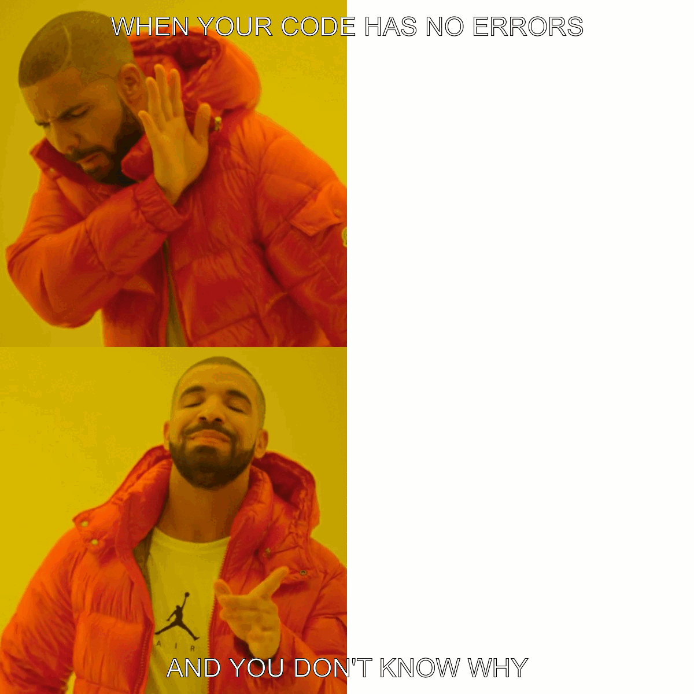

```{r setup, include=FALSE}
knitr::opts_chunk$set(echo = TRUE)
```

## Introduction

In this project, I created images and memes using R. I used the `magick` package to read, edit, and annotate images. This project helped me understand how to manipulate images programmatically.

---

## Creating a static meme

Below is the R code I used to create a static meme:

```{r}
library(magick)

img <- image_read("my_meme.png")

meme <- img %>%
  image_annotate("WHEN YOUR CODE HAS NO ERRORS",
                 size = 45,
                 color = "white",
                 strokecolor = "black",
                 gravity = "north",
                 location = "+0+20") %>%
  image_annotate("AND YOU DON'T KNOW WHY",
                 size = 45,
                 color = "white",
                 strokecolor = "black",
                 gravity = "south",
                 location = "+0+20")

meme
```
Below is the animated meme I created:
<p align="center">

</p>